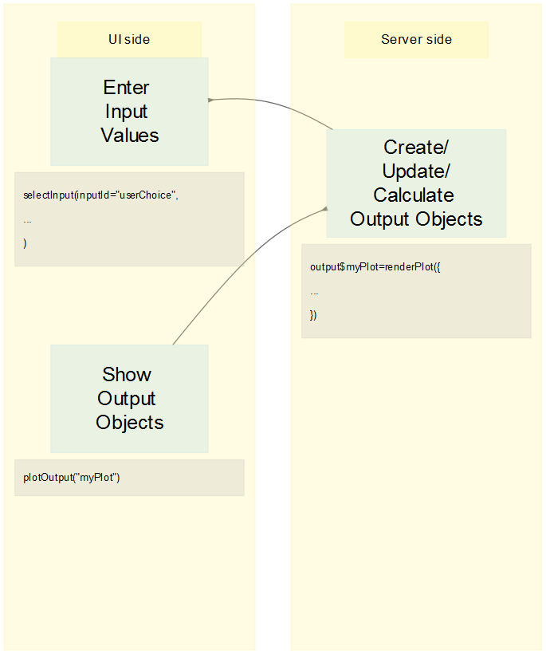

```{r setup, include=FALSE}
knitr::opts_chunk$set(echo = TRUE)
library(dplyr)
library(ggplot2)
library(readr)
library(lubridate)
library(stringr)
```

# Shiny: qu'est-ce que c'est?
<div class="left">
Shiny, c'est un **package R** qui facilite la construction d'**applications web** interactives depuis R.


Les utilisateurs peuvent simplement manipuler une application "clique-boutons" pour exécuter et afficher des résultats fournis par du code R.

Les résultats fournis sont (de manière générale) **réactifs**, c'est-à-dire que quand l'utilisateur fournit une nouvelle valeur d'**input** (= paramètre d'entrée) via un **widget**(= window gadget), les codes R qui dépendent de cet input sont réexecutés et leurs sorties affichées.

</div>
<div class="right">

Vous avez tout un tas d'exemples d'applis Shiny [ici, dans la Shiny gallery](https://shiny.rstudio.com/gallery/). 

Remarquez que toutes ces applications (qui, de fait, s'affichent dans votre navigateur internet) sont (surprise!) écrites en **html**... Par contre, on peut les produire sans connaître du tout (surprise surprise!!) le langage **html**. En effet, elles peuvent être produites exclusivement via le langage R. (Même si une connaissance de **html** et **css** reste un plus pour produire de jolies apps...).
</div>

# Shiny: qu'est-ce que c'est?

<div class="left">
Une Shiny App se structure en deux parties:

-un côté "UI" qui regroupe tous les éléments de **mise en forme et d'affichage** de l'interface utilisateur elle-même (affichage des inputs *et des outputs*)
-un côté "Server" où sont exécutés les codes R qui servent à **produire les outputs** (graphiques, tables, traitements, etc.)


</div><div class="right">


</div>

# Introduction: démarrer avec le template

<div class="left">
Pour construire votre première appli Shiny, vous pouvez vous aider du **modèle** ("template"") fourni par RStudio, en faisant File -> New project -> New directory -> Shiny web application.

Deux fichiers sont alors créés: **server.R**, et **ui.R**.

- La partie **serveur** contient l'ensemble du code R qui doit être executé par l'appli pour fournir les sorties.
- La partie **ui** (= user interface) contient les instructions de construction/mise en forme de l'interface utilisateur.

Vous pouvez ouvrir l'un ou l'autre, et activer le bouton **Run App** en haut à droite de la partie "script" de l'interface RStudio pour **construire** (et tester) l'appli.

</div><div class="right">

</div>

# Introduction: déploiement des applications à distance

<div class="left">


Quand vous construisez et testez votre app,  l'ordinateur qui affiche l'interface =l'ordinateur qui effectue les calculs (car dans ce cas, **l'utilisateur = le développeur = vous**).

</div><div class="right">

En revanche, si vous souhaitez que votre app soit utilisable par un autre utilisateur que vous même, vous pouvez procéder de deux manières:

- **fournir votre app** (i.e. l'ensemble des scripts et arborescence) à l'utilisateur. C'est-à-dire qu'il faut que l'utilisateur soit capable de (et disposé à) enregistrer cette app sur son ordinateur, installer R si besoin, et lancer l'application depuis R. Sauf si votre interlocuteur connaît bien R, ce n'est pas très pratique...
- **déployer votre app** sur un serveur distant. Dans ce cas l'utilisateur n'a ni besoin d'avoir R sur son ordinateur, ni de savoir comment R fonctionne. En fait, il peut utiliser l'app sans avoir aucune conscience qu'il y a du R derrière...

Dans le cas où vous déployez votre app sur un serveur distant, cela veut dire qu'il y a une gentille structure qui vous "offre" gratuitement de la puissance de calcul sur son serveur... Cela n'est donc pas, généralement, totalement gratuit et/ou totalement illimité...
</div>

# Construire une app (1)

<div class="left">

</div><div class="right">

 ui:

- Ajoutez des **éléments d'entrée** à l'interface avec les fonctions de type **xxxInput()**
- Ajoutez des **éléments de sortie** à l'interface avec les fonctions de type **xxxOutput()**

 server:

- Encapsulez le code utilisé pour créer l'output dans une fonction de type **renderXxx()**
- **Assignez à l'output** la sortie de renderXxx().

</div>

# Construire une app (1)

<div class="left">


</div><div class="right">

 ui:

- Ajoutez des **éléments d'entrée** à l'interface avec les fonctions de type **xxxInput()**
- Ajoutez des **éléments de sortie** à l'interface avec les fonctions de type **xxxOutput()**

 server:

- Encapsulez le code utilisé pour créer l'output dans une fonction de type **renderXxx()**
- **Assignez à l'output** la sortie de renderXxx().

</div>

# Construire une app (2)

<div class="left">

</div><div class="right">
Deux structures de base sont possibles pour les apps: soit avoir tout réuni dans un même script (**app.R**) soit séparer la partie ui et la partie server dans deux fichiers (**ui.R** et **server.R**). C'est cette deuxième solution que nous allons privilégier.

Dans l'exemple de gauche, **ui** est un *objet de type UI* issu de l'appel à une *fonction* -ici, fluidPage()-. Les différents éléments passés à fluidPage() sont donc des *arguments* (i.e. ils sont séparés par des virgules!). 

Au contraire, dans **server** on définit une *fonction*, ayant pour arguments *input* et *output*. Le corps de cette fonction s'écrit donc comme une suite de lignes de commandes (i.e. les commandes sont séparées par des retours à la ligne!)
</div>

# Construire une app (3)

<div class="left">

</div><div class="right">
Le répertoire qui contient votre application doit être construit d'une manière qui facilite son déploiement sur un serveur distant. Le mieux ainsi d'avoir:

- **ui.R**, **server.R**, et éventuellement **global.R** à la racine
- des sous-dossiers pour (par exemple) les données, des scripts, etc.
- un dossier **www** qui permet de faire référence à des éléments utiles au navigateur web, *qui ne sont pas issus de calculs de R* (images, photos, logos, feuilles de style css, etc.)

Les commandes du fichier **global.R** sont exécutées dans un environnement... *global*. C'est-à-dire que les packages qu'on y charge ou les objets qu'on y crée seront disponibles à la fois pour les parties UI et Server. Les commandes de **global** sont donc exécutées une bonne fois pour toutes (c'est-à-dire, une fois par session, et avant toute autre chose) au lancement de la Shiny App.

</div>

