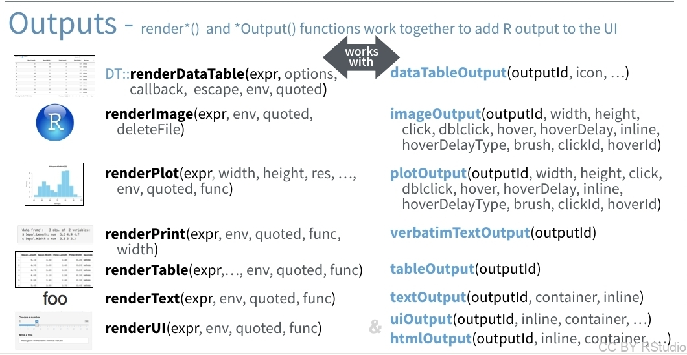

```{r setup, include=FALSE}
knitr::opts_chunk$set(echo = TRUE, cache=FALSE)
#library(magick)
library(dplyr)
library(ggplot2)
#source("create_images.R")
library(readr)
library(lubridate)
library(stringr)
```

# Widgets

<div class="left">

Les **widgets** sont les composants de l'interface graphique qui permettent aux utilisateurs de fournir des valeurs aux paramètres d'entrée.

Vous pouvez avoir un aperçu de l'ensemble des widgets disponibles pour Shiny via la [Shiny Widgets Gallery](https://shiny.rstudio.com/gallery/widget-gallery.html).
</div><div class="right">


</div>

# Widgets - Choix multiple

<div class="left">

</div><div class="right">

Pour choisir **une ou plusieurs valeurs** parmi plusieurs valeurs **prédéfinies**, plusieurs widgets sont disponibles:

- **radioButtons** et **selectInput** permettent de choisir **une valeur**.
- **checkboxGroupInput** et et **selectInput(..., multiple=TRUE)** permettent de choisir **plusieurs valeurs**.
</div>

# Widgets - Numérique
<div class="left">

</div><div class="right">
Attention, bien qu'ils soient construits pour entrer des valeurs numériques, ils fournissent une valeur de type **chaîne de caractère** au serveur (ie "33" et non 33).
</div>

# Widgets - Texte
<div class="left">

</div><div class="right">
- **textInput** (pour un texte court) ou **textAreaInput** (pour un texte plus long, par exemple un paragraphe de commentaires)
- **passwordInput** pour un mot de passe (les caractères sont masqués)
</div>

# Widgets - Divers
<div class="left">

</div>
<div class="right">
Parmi les autres widgets les plus utiles, on trouve:

- **fileInput** qui permet de rechercher un fichier
- **checkboxInput** qui permet de spécifier si un paramètre a pour valeur TRUE ou FALSE
- **dateInput** et **dateRangeInput** qui permettent de spécifier des dates.
</div>

# Widgets - Triggers 

<div class="left">


</div><div class="right">
Les **triggers** permettent à l'utilisateur de lancer certains processus. Ils sont particulièrement utiles pour lancer des processus *un peu longs*. J'y reviendrai un peu plus tard, quand j'aborderai le sujet de la **réactivité**
</div>

# Outputs (1)

<div class="left">


</div>
<div class="right">

Dans les exemples précédents, on a vu différents exemples d'outputs possibles. Notamment, des outputs de type

- **plot** (renderPlot({}) + plotOutput())
- **texte** (renderText({}) + textOuptut())
- **table** (renderTable({}) + tableOutput())

Il est également possible de produire des outputs de type

- **image** (renderImage({}) + imageOutput()): à ne pas confondre avec plot, i.e. ce sont des images qui ne font pas l'objet d'un "affichage" par R mais sont enregistrées, en .jpg ou .png par exemple.
- **ui** : (renderUi({}) + uiOutput()): cela correspond à la production d'un nouveau "morceau" d'interface utilisateur (du html, donc!).
</div>

# Outputs (2)

<div class="left">


Remarquez, dans le graphique ci-dessus, comme une fonction **renderXxx() côté Server** correspond à une fonction **xxxOutput() côté UI**.

<small> Attention à ne pas vous tromper car si vous faites quelque chose du genre `output$pouetpouet=renderTable({...})` côté Server et `plotOutput("pouetpouet")` côté UI vous obtiendrez vraisemblablement un affichage vide...</small>

</div>
<div class="right">

Et pour rappel, voici comment ça se passe au niveau syntaxe:


</div>