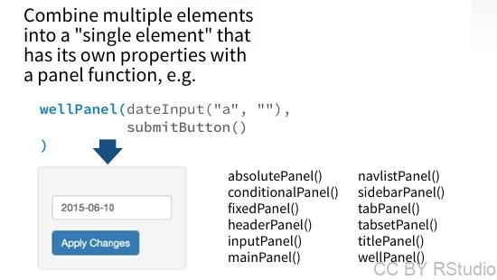

```{r setup, include=FALSE}
knitr::opts_chunk$set(echo = TRUE)
#library(magick)
library(shiny)
library(dplyr)
library(ggplot2)
#source("create_images.R")
library(readr)
library(lubridate)
library(stringr)
```

# Panels


<div class="row"><div class="column">



Les **panels** permettent de réunir différents éléments (widgets, textes, images...). Les différents types de panels correspondent à différents **styles** (par exemple, fonds gris pour wellPanel(), caractères colorés pour titlePanel(), etc.)

Il est possible de **combiner différents types de panels** en les **juxtaposant** ou en les **emboîtant**, comme dans l'exemple ci-contre.

Tout ce que je vais vous montrer dans cette partie **concerne la partie UI des Shiny Apps**!!

</div>
<div class="column">

```{r panels1}
fluidPage(
  titlePanel("Ceci est un titlePanel"),
  fluidRow(column(width=6,
                  "Ceci est une première colonne"
                  ),
           column(width=2,
                  "Ceci est une deuxième colonne"
                  ),
           column(width=4,
                  "Ceci est une troisième colonne",
                  wellPanel("Ceci est un wellPanel")
                  )
           )#fluidRow  
)#fluidPage
```

<small> Dans la partie UI, il y a souvent des parenthèses et des virgules dans tous les sens... alors pour m'y retrouver j'indique parfois *ce qui est fermé par les parenthèses fermantes* en commentaire... </small>
</div>
</div>

# Layouts (1)

On peut par ailleurs utiliser des types de **layouts** prédéfinis pour organiser son appli...

Vous pouvez tester la différence entre ces types de layout en modifiant la taille de la fenêtre...

<div class="row"><div class="column">


- **fluidRow()** permet de définir précisément l'organisation de l'appli, en lignes et colonnes. Chaque ligne compte 12 unités de largeur au total.
- **flowLayout()** adapte le layout en fonction de la taille totale de l'élément et la taille des éléments qui le composent.

Vous pouvez tester la différence entre ces types de layout en modifiant la taille de la fenêtre...

</div>

<div class="column">

```{r layouts1a}
wellPanel(
  "We want funny cats and dogs!",
  img(src="www/funny_cats.jpg"),
  img(src="www/funny_dogs.jpg"),
  hr(),h2("fluidRow:"),
  fluidRow(
    column(width=2,"We want funny cats and dogs!"),
    column(width=5,img(src="www/funny_cats.jpg")),
    column(width=5,img(src="www/funny_dogs.jpg"))
  ),
  hr(),h2("flowLayout:"),
  flowLayout(
   "We want funny cats and dogs!",
    img(src="www/funny_cats.jpg"),
    img(src="www/funny_dogs.jpg")
  )
)
```

</div></div>

# Layouts (2)

On peut par ailleurs utiliser des types de **layouts** prédéfinis pour organiser son appli...

Vous pouvez tester la différence entre ces types de layout en modifiant la taille de la fenêtre...

<div class="row"><div class="column">


- **sidebarLayout()** permet de diviser la fenêtre en deux éléments: un élément latéral plus étroit (qui contiendra généralement des input widgets) et un élément principal (qui contiendra généralement des outputs). 
- **splitLayout()** permet de diviser la fenêtre en éléments de taille égale. Si le contenu des éléments est trop important l'élément devient "scrollable".
- **verticalLayout()** dispose les éléments les uns en dessous des autres.

</div>

<div class="column">

```{r layouts2a}
wellPanel(
  img(src="www/funny_cats.jpg"),
  img(src="www/funny_dogs.jpg"),
  img(src="www/cute_cats.jpg"),
  hr(),h2("splitLayout:"),
  splitLayout(
    img(src="www/funny_cats.jpg"),
    img(src="www/funny_dogs.jpg"),
    img(src="www/cute_cats.jpg")
  ),
  hr(),h2("verticalLayout:"),
  verticalLayout(
    img(src="www/funny_cats.jpg"),
    img(src="www/funny_dogs.jpg"),
    img(src="www/cute_cats.jpg")
  )  
)
```

</div></div>


# Layouts en couches

<div class="row"><div class="column">


```{r layouts3a}
wellPanel(
  tabsetPanel(tabPanel("tab 1",img(src="www/cute_dogs.jpg")),
              tabPanel("tab 2",img(src="www/funny_dogs.jpg")),
              tabPanel("tab 3",img(src="www/cute_cats.jpg")),
              tabPanel("tab 4",img(src="www/funny_cats.jpg"))
              )
)
```

</div>
<div class="column">


```{r layouts3b}
wellPanel(
  navlistPanel(tabPanel("tab 1",img(src="www/cute_dogs.jpg")),
               tabPanel("tab 2",img(src="www/funny_dogs.jpg")),
               tabPanel("tab 3",img(src="www/cute_cats.jpg")),
               tabPanel("tab 4",img(src="www/funny_cats.jpg"))
               )
)
```

```{r layouts3c}
wellPanel(
  navbarPage("Menu",
             tabPanel("tab 1",img(src="www/cute_dogs.jpg")),
             tabPanel("tab 2",img(src="www/funny_dogs.jpg")),
             tabPanel("tab 3",img(src="www/cute_cats.jpg")),
             tabPanel("tab 4",img(src="www/funny_cats.jpg"))
            )
)
```
</div></div>


</div></div>
