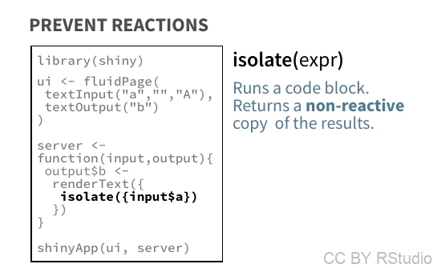

```{r setup, include=FALSE}
knitr::opts_chunk$set(echo = TRUE)
#library(magick)
library(dplyr)
library(ggplot2)
#source("create_images.R")
library(readr)
library(lubridate)
library(stringr)
library(shiny)
library(rmarkdown)
library(knitr)
```


# Réactivité : base

<div class="left">

</div>
<div class="right">
Dans sa version la plus simple, la chaîne de réactivité ressemble en fait à ceci :


C'est, pour le moment, le seul type de réaction que l'on a abordé.
</div>

# Fournir des outputs réactifs

<div class="left">

</div>

<div class="right">
Pour rappel, voici comment l'on procède pour fournir un output réactif:


</div>

# Fournir des outputs réactifs - exemple (1)
<div class="left">


</div>
<div class="right">

Observez le diagramme ci-contre, qui décrit un exemple de Shiny app, comprenant 

* 3 inputs:
    + input_a
    + input_b
    + input_c
* 2 outputs:
    + output_d (qui dépend seulement de input_a)
    + output_e (qui dépend de input_a, input_b et input_c)
    
Je vais utiliser cet exemple pour illustrer le fonctionnement de la **réactivité** des Shiny apps.

</div>

# Fournir des outputs réactifs - exemple (2)

<div class="left">

Commençons par simplifier et expliquer ce diagramme:


</div>

<div class="right">


Observez le sens des flèches... 
Quand un input est modifié, il est **aspiré** par le contexte réactif... Et non l'inverse (il n'est **pas poussé** vers le contexte réactif)... Et, oui, la différence est subtile, mais importante pour la suite...

Observez maintenant la couleur de fond du contexte réactif. A gauche, tout est pour le moment en gris, mais par la suite on pourra observer plusieurs états pour les contextes réactifs:

- un état **attentif** (en orange)
- un état **en cours d'exécution** (en violet)
- un état **inerte** (en gris)

</div>

# Fournir des outputs réactifs - exemple (3)

<div class="row"><div class="column">
Considérons une première "configuration" de Shiny app. (Avec l'exemple correspondant à droite).


Ici, par défaut, seul **output_e** est affiché. Il est donc **attentif**, là où output_d est au contraire **inerte**.

<small> Notez que quand l'utilisateur change de panel (en affichant "tab1" à la place de "tab2"), c'est au contraire output_d qui est attentif tandis que output_e est inerte...</small>


</div><div class="column">
 ui
```{r reac1,eval=FALSE}
  flowLayout(radioButtons("a","Word 1:", c("Hello","Greetings")),
             radioButtons("b","Word 2:", c("benevolent","great")),
             radioButtons("c","Word 3:", c("Master","Human"))),
  tabsetPanel(tabPanel("tab1",textOutput("d")),
              tabPanel("tab2",textOutput("e")),
              selected="tab2")
```
 server
```{r reac1s, eval=FALSE}
  output$d <- renderText({Sys.sleep(1);paste(input$a,"!")})
  output$e <- renderText({Sys.sleep(1);paste(input$a,",",input$b,input$c,"!")})
```

<iframe src="https://r-atique.shinyapps.io/reac1/" height="200" width="800"></iframe> 

<small>Ici j'ai fait en sorte de mettre le système en pause pendant une seconde (`Sys.sleep(1)`) pour que vous puissiez bien constater à quel moment le code dans les contextes réactifs est exécuté...</small>
</div></div>


# Fournir des outputs réactifs - exemple (4)


<div class="row"><div class="column">

Quand cette app est lancée, voilà donc ce qui se passe:


**shows output_e** est attentif, donc **makes output_e** est attentif, et aspire les 3 inputs (qui sont tous *nouveaux*) afin d'exécuter son code.

</div><div class="column">

Par la suite, l'output qui est attentif est actualisé à chaque fois qu'un de ses inputs (ici par exemple input_b) est modifié...


</div></div>

# Modulariser les réactions

<div class="left">


<small>Vous avez déjà vu que les fonctions servent à "modulariser" du code (i.e., faire en sorte que certains morceaux de code soient "encapsulés" dans une structure qui permet de l'appeler et l'exécuter assez simplement...).</small>

Les **reactives**, quant à elles, sont des fonctions qui permettent de modulariser du code réactif... L'usage de reactives est particulièrement utile lorsque certains morceaux de code sont utilisés par **plusieurs outputs à la fois**... Ainsi, comme l'écriture de fonctions en général, l'écriture de reactives permet d'éviter certaines redondances dans le code.
</div>

<div class="right">

</div>


# Modulariser les réactions - exemple
<div class="row"><div class="column">

Considérons cette nouvelle structure d'appli...


Ici on a introduit une **réactive** f().

Ici encore, vous trouverez un exemple d'une telle structure d'appli (à droite). 

La réactive **f()** sert ici à créer le chemin de l'image à partir de l'input ("heart" ou "sun"). Les deux ouptuts utilisent cette fonction pour afficher l'image correspondante.

</div><div class="column">

 ui
```{r reac2, eval=FALSE}
  fluidRow(column(width=4,radioButtons("A","Image:", c("heart","sun"))),
           column(width=4,radioButtons("B","Word 1:", c("Hello","Greetings"))),
           column(width=4,radioButtons("C","Word 2:", c("Master","Human")))),
  tabsetPanel(selected="tab2",
              tabPanel("tab1",uiOutput("D")),
              tabPanel("tab2",uiOutput("E")))
```

 server
```{r reac2s, eval=FALSE}
  f=reactive({
    Sys.sleep(1)
    result=paste0("www/",input$A,".png")
  })
  output$D <- renderUI({img(src=f())})
  output$E <- renderUI({p(img(src=f())," ",input$B,",",input$C,"!")})
```

<iframe src="https://r-atique.shinyapps.io/reac2/" height="200" width="800"></iframe> 

<small> Ici, la seconde de "pause" intervient quand la réactive est exécutée. Remarquez que quand vous changez de tab, la réactive n'est pas réexécutée... La réactive est réexécutée seulement quand son input est modifié!</small>
</div></div>

# Provoquer/retarder l'exécution: utilisation des triggers

Dans le mécanisme de réactivité le plus classique, un code est exécuté quand il correspond à un output "attentif" et que l'un de ses inputs est modifié. 

Il est possible de contourner ce mécanisme et de faire en sorte que l'exécution d'un code soit **déclenché par l'utilisateur**. 

Ce genre de mécanisme va de pair avec l'utilisation des widgets de type "trigger":


# Déclencher/provoquer l'exécution d'un code

<div class="row"><div class="column">


Dans ce cas, le code exécuté **ne correspond pas à un output de l'appli**. Il peut s'agir d'un code permettant par exemple:

- l'écriture d'un fichier (tableau de données, figure, raster, etc.)
- l'affichage d'un résultat (`print(...)`) dans la console
- un update de widget


</div>
<div class="column">


 ui
```{r trigger_code, eval=FALSE}
actionButton("go","go!")
```

 server
```{r trigger_code_s, eval=FALSE}
observeEvent(input$go,{
  updateActionButton(session,
                     inputId="go",
                     label=str_c(str_c(rep("go",input$go+1),
                                       collapse=", "),
                                 "!")
                     )
})
```


<iframe src="https://r-atique.shinyapps.io/reac3/" height="100" width="300"></iframe> 

</div>
</div>


# Déclencher/retarder une réaction

<div class="row"><div class="column">


Dans ce cas, le code est exécuté **non pas dès que l'un de ses inputs est modifié, mais lorsque que l'utilisateur déclenche la réaction**. 

Le fait pour l'utilisateur de valider l'exécution d'un code permet notamment de gérer l'exécution de codes un peu trop longs pour une "instantanéité" d'affichage des résultats.

</div>
<div class="column">


```{r delay_reaction,eval=FALSE}
actionButton("now","Now!"),
textOutput("time")
```

```{r delay_reaction_s, eval=FALSE}
reac=eventReactive(input$now,{
  as.character(Sys.time())
})
output$time=renderText({
  str_c("The time right now is: ",reac())
  })
```


<iframe src="https://r-atique.shinyapps.io/reac4/" height="200" width="600"></iframe> 
</div></div>


# Empêcher des réactions

<div class="row"><div class="column">

</div>

<div class="column">



```{r prevent_reactions,eval=FALSE}
fluidRow(column(width=4,textInput("word1","First word","Hello")),
         column(width=4,textInput("word2","Second word","Master")),
         column(width=4,textOutput("combi"))
)
```
```{r prevent_reactions_s,eval=FALSE}
output$combi <- renderText({paste(input$word1,isolate(input$word2))})
```
```{r label="prevent_reactions_s", eval=FALSE}
```

<iframe src="https://r-atique.shinyapps.io/reac5/" height="200" width="600"></iframe>

Ici, l'output n'est actualisé que quand le deuxième input est modifié. **Une modification du premier input ne déclenche pas le code contenu dans le contexte réactif**.

</div></div>
