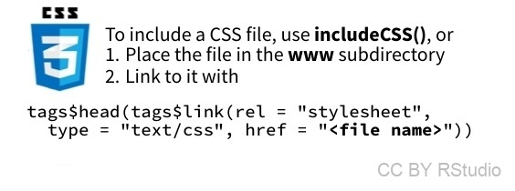

```{r setup, include=FALSE}
knitr::opts_chunk$set(echo = TRUE)
#library(magick)
library(dplyr)
library(ggplot2)
#source("create_images.R")
library(readr)
library(lubridate)
library(shiny)
```


# Du html

<div class="row">
<div class="column">

L'interface qui s'affiche dans votre navigateur web est écrite **en html**. 

<small> Pour ceux qui ne sont pas du tout familiers de ce langage, le html, c'est ce que vous voyez quand vous affichez le code source d'une page html dans un éditeur de texte, ou quand vous cliquez-droit=>examinez l'élément d'une page web dans votre navigateur.</small>

</div><div class="column">

Ce langage décrit les pages web comme un ensemble de "boîtes" emboîtées ou juxtaposées, et dont la disposition et le style sont prédéfinis...

Les boîtes peuvent par exemple correspondre à des types (tags) de type:

- paragraphe 
- titre 
- titre de niveau 1
- image
- tableau
etc.

</div></div>

# Ajout d'éléments html: wrappers

<div class="row"><div class="column">

Pour rajouter des éléments de mise en forme de type "tag html", il est possible d'utiliser des "wrapper functions" comme `p()`, `h1()`, `strong()`, etc.


</div>
<div class="column">

Vous pourrez trouver [ici](http://www.hostingreviewbox.com/wp-content/uploads/2016/02/html5-cheat-sheet-1.png) une description succinte des différents tags html.

</div>
</div>

# Ajouts d'éléments html: tags$xxx()

<div class="row"><div class="column">
Si le html tag qui vous intéresse est un peu plus "spécial" et ne correspond pas à une wrapper function, alors vous pouvez recourir à la liste **tags** ci-contre.

Par exemple:

```{r}
wellPanel(
tags$img(src="www/heart.png"), 
tags$p("J'aime les chats"),
tags$small("et le chocolat")
)
```
</div>
<div class="column">


</div>
</div>


# Inclusion d'éléments de style css

<div class="row">
<div class="column">

Par défaut, le "style" appliqué aux différents tags est prédéfini: les textes des paragraphes font telle taille, sont écrits dans telle police, sur fond de telle couleur, etc. Mais comme pour une page web classique, il est possible de changer le **style** de certains tags en ayant recours à une feuille de style **css**.



</div>

<div class="column">

L'idée est de créer un fichier dont l'extension sera **.css**, de le placer dans le dossier www, et de **lier** cette feuille de style à l'appli via la commande notée dans la figure ci-contre...

Dans la feuille de style, vous pouvez choisir de modifier certains tags de la manière suivante:

```{CSS, eval=FALSE}
h1 {
   font-size:2.2em;
   color: #9999ff;
}
```

Ici par exemple, les tags de type "h1" (c'est-à-dire les titres de premier niveau) sont modifiés au niveau de leur taille et couleur de police (la couleur est spécifiée par son code hexadecimal).

<small> Loin de moi l'idée de faire un cours sur le langage html ou le CSS (je ne m'y connais pas assez) alors voici [une super ressource pour en savoir plus](https://www.w3schools.com/css/default.asp)!</small>

</div></div>
